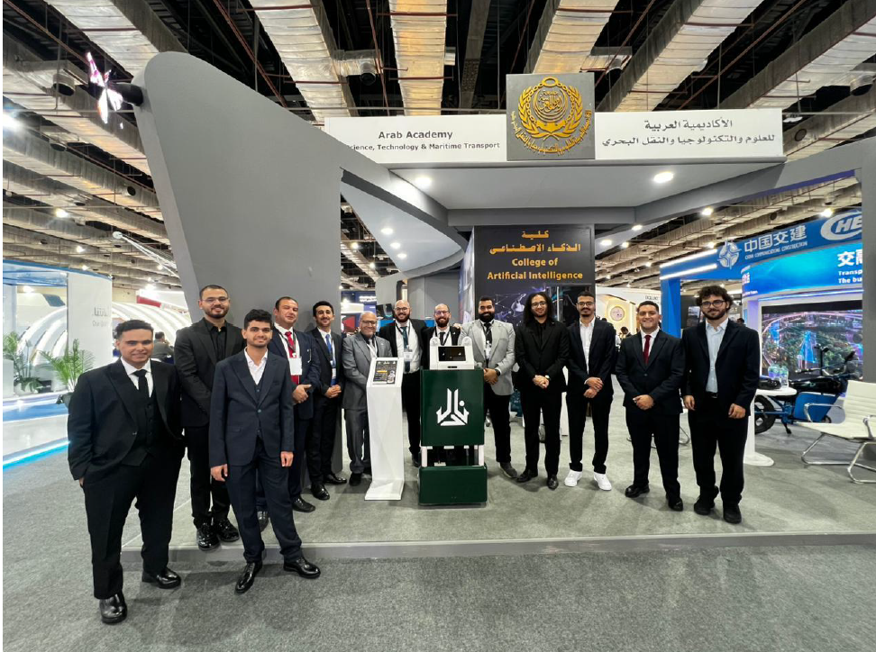

<div align="center">

# 🤖 NADEL
## Fully Autonomous Restaurant Service Robot

### An AI-Powered Autonomous Waiter Robot for Smart Restaurants




---

### 🎥 Project Demonstration

> **Watch the complete robot demonstration here**

📺 **YouTube:** *https://youtu.be/ssEcgQ2G6kU*

---

</div>

# 📖 Overview

**NADEL** is a fully autonomous AI-powered restaurant service robot designed to assist restaurant staff by autonomously delivering food and beverages to customers.

The robot combines modern robotics, artificial intelligence, embedded systems, and autonomous navigation into a single platform capable of navigating indoor restaurant environments while safely interacting with customers.

NADEL integrates:

- Autonomous Navigation
- SLAM Mapping
- ROS2 Navigation Stack (Nav2)
- AI Voice Assistant
- Human-Robot Interaction
- ESP32 Embedded Control
- Smart Restaurant Integration
- Table-side Call & Pay System

The project was developed as a graduation project for the **College of Artificial Intelligence** at the **Arab Academy for Science, Technology and Maritime Transport (AASTMT).**

---

# ✨ Features

- 🤖 Fully autonomous indoor navigation
- 🗺️ SLAM-based mapping
- 📍 Autonomous localization
- 🚧 Dynamic obstacle avoidance
- 🍽️ Autonomous food delivery
- 🗣️ Arabic & English voice interaction
- 🧠 AI-powered request interpretation
- 📱 Touchscreen customer interface
- 📡 ESP32-based wireless communication
- 🔔 Table-side Call & Pay module
- 🔋 Battery-powered operation
- 🛞 Differential drive robot
- 📷 RGB-D camera integration
- 📡 LiDAR navigation
- 🔊 Voice responses
- 💻 ROS2-based modular software

---

# 📸 Gallery

| Robot | Navigation | Mapping |
|--------|------------|----------|
|  |  |  |

| Interface | Robot Side | Robot Rear |
|------------|------------|------------|
|  |  |  |

---

# 🏗 System Architecture

```
                    Smart Restaurant System
                              │
                              │
                ┌─────────────▼─────────────┐
                │     Jetson Orin Nano      │
                │        ROS2 Humble        │
                └─────────────┬─────────────┘
                              │
      ┌──────────────┬────────┼──────────────┐
      │              │        │              │
      ▼              ▼        ▼              ▼
 Navigation      Voice AI   Web UI      micro-ROS
 (Nav2)          (Whisper)  Interface     Bridge
      │                               │
      └──────────────┬────────────────┘
                     ▼
                  ESP32
                     │
      ┌──────────────┼──────────────┐
      ▼              ▼              ▼
  Motors         Encoders      Ultrasonic
                     │
                     ▼
                Robot Motion
```

---

# 🧠 Software Stack

| Component | Technology |
|------------|------------|
| Operating System | Ubuntu 22.04 |
| Robotics Framework | ROS2 Humble |
| Navigation | Nav2 |
| Mapping | SLAM Toolbox |
| Localization | AMCL |
| Visualization | RViz2 |
| Simulation | Gazebo |
| AI | Whisper Small |
| LLM | Gemma |
| Embedded | ESP32 |
| Communication | micro-ROS |
| Interface | HTML CSS JavaScript |
| Programming | Python + C++ |

---

# 🔧 Hardware

| Component | Description |
|------------|-------------|
| NVIDIA Jetson Orin Nano | Main Computer |
| ESP32 | Low-level Controller |
| RPLIDAR A1M8 | 360° LiDAR |
| Intel RealSense D435i | RGB-D Camera |
| MPU6050 | IMU |
| Ultrasonic Sensors | Obstacle Detection |
| DC Motors | Differential Drive |
| Wheel Encoders | Odometry |
| 10.1" Touchscreen | User Interface |
| Speakers | Voice Output |
| Microphone | Voice Input |
| 36V Battery | Power Supply |

---

# 🛣 Navigation Pipeline

```
LiDAR
      ↓
SLAM Toolbox
      ↓
Map
      ↓
Localization
      ↓
Nav2 Planner
      ↓
Controller
      ↓
ESP32
      ↓
Motor Driver
      ↓
Robot Motion
```

---

# 🎙 Voice Interaction

```
Customer

↓

Microphone

↓

Whisper Speech Recognition

↓

Gemma AI

↓

Intent Detection

↓

Robot Decision

↓

Speech Output

↓

Customer
```

---

# 🍽 Restaurant Workflow

```
Customer Places Order

↓

Kitchen

↓

Robot Receives Task

↓

Navigation

↓

Obstacle Avoidance

↓

Table Arrival

↓

Food Delivery

↓

Robot Returns Home
```

---

# 📂 Repository Structure

```
Nadel-Autonomous-Waiter-Robot/
│
├── README.md
├── LICENSE
├── .gitignore
│
├── docs/
│   ├── Nadel_Final_Book.pdf
│   ├── Poster.pdf
│   └── Presentation.pdf
│
├── images/
│
├── videos/
│
├── ros2_ws/
│   ├── src/
│   │   └── nadel_robot/
│   │       ├── launch/
│   │       ├── rviz/
│   │       ├── src/
│   │       ├── urdf/
│   │       ├── CMakeLists.txt
│   │       └── package.xml
│   │
│   ├── config/
│   │   ├── amcl_config.yaml
│   │   ├── behavior.xml
│   │   ├── bt_navigator.yaml
│   │   ├── cartographer.lua
│   │   ├── controller.yaml
│   │   ├── planner_server.yaml
│   │   ├── recovery.yaml
│   │   ├── map.yaml
│   │   └── map.pgm
│   │
│   ├── launch/
│   │   ├── localization.launch.py
│   │   ├── mapping.launch.py
│   │   └── navigation.launch.py
│   │
│   └── rviz/
│       ├── mapping.rviz
│       └── nav.rviz
│
└── esp32/
    └── robot_controller/
        └── Finalmicroroscontroller.ino
```

---

# 🚀 Installation

## Clone Repository

```bash
git clone https://github.com/YoussefIEissa/Nadel-Autonomous-Waiter-Robot.git

cd Nadel-Autonomous-Waiter-Robot
```

---

## Install ROS2

```bash
sudo apt update

sudo apt install ros-humble-desktop-full
```

---

## Build Workspace

```bash
cd ros2_ws

colcon build

source install/setup.bash
```

---

# ▶ Running

Launch Robot

```bash
ros2 launch nadel_robot bringup.launch.py
```

Launch Navigation

```bash
ros2 launch navigation navigation.launch.py
```

Launch Interface

```bash
ros2 launch ui ui.launch.py
```

---

# 🧪 Testing

The robot has been tested for:

- Autonomous Navigation
- Localization Accuracy
- Obstacle Avoidance
- Voice Interaction
- Table Delivery
- ESP32 Communication
- Human-Robot Interaction
- Complete Restaurant Workflow

---

# 📊 Project Highlights

✅ Autonomous indoor navigation

✅ Differential drive mobile robot

✅ ROS2 Humble

✅ Nav2 Navigation Stack

✅ SLAM Toolbox

✅ ESP32 Embedded System

✅ AI Voice Assistant

✅ Touchscreen User Interface

✅ Autonomous Food Delivery

✅ Table-side Call & Pay Module

---

# 🔮 Future Work

- Multi-floor navigation
- Autonomous charging dock
- Multi-robot coordination
- Cloud-connected restaurant management
- Vision-based tray monitoring
- AI customer recognition
- Dynamic table detection
- Autonomous elevator integration

---

# 👨‍💻 Team

**Graduation Project**

College of Artificial Intelligence

Arab Academy for Science, Technology and Maritime Transport

### Team Members

- Youssef Ibrahim
- Abdallah Elsayed
- Abdelrahman Mostafa
- Abdelrahman Eid
- Youssef Elfeshawy
- Yusuf Osama

---

# 👨‍🏫 Supervisors

- Dr. Ahmed Abouelfarag
- Eng. Mohamed Elsayed

---

# 📚 Citation

If you use this project in your research, please cite:

```
NADEL: Fully Autonomous Restaurant Service Robot,
AASTMT,
College of Artificial Intelligence,
2026.
```

---

# 📜 License

This project is licensed under the MIT License.

---

<div align="center">

## ⭐ If you found this project interesting, consider giving it a Star!

### Built with ❤️ using ROS2, AI, Embedded Systems, and Robotics

</div>